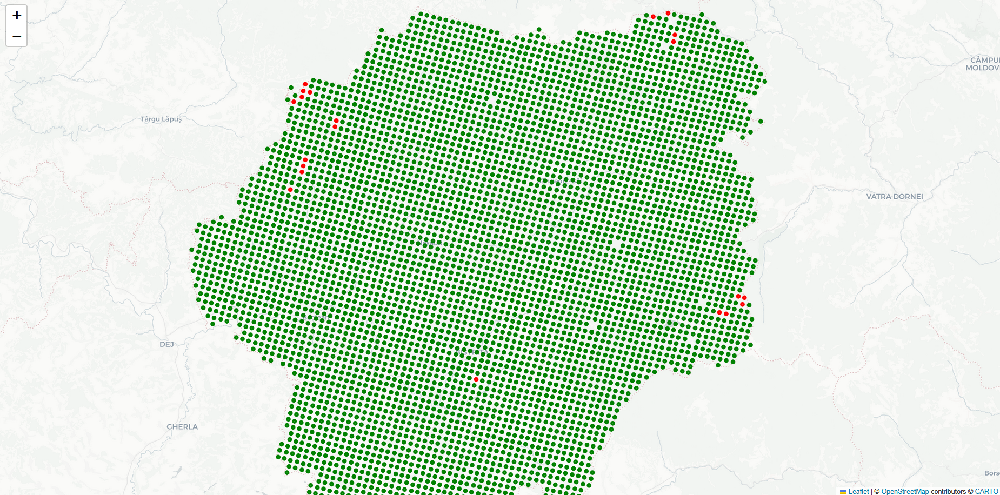

# Fire Detection from Land Surface Temperature (LST)

## Idea and Motivation

Forest fires are one of the most critical environmental threats in Europe, affecting ecosystems, human safety, and climate.
This project explores the potential of **Land Surface Temperature (LST)** data (from the Copernicus Sentinel-3 mission)
in order to detect abnormal heating patterns that may indicate fire events.

## Technologies Used
### Copernicus Sentinel-3 LST products 
  -  to obtain land surface temperature data at scale.
  -  
### Python with these main libraries: numpy, pandas
  — numerical data processing

### geopandas, folium 
  — spatial data handling and map visualizations

### scikit-learn
  — implementing Random Forest model

### joblib
  — saving and loading trained models

***Pseudo-labeling using local statistics (median, MAD, zMAD) to automatically derive positive/negative classes.***

***Random Forest Classifier chosen because of its interpretability, robustness to noisy data, and effectiveness on imbalanced datasets.***

## Setup and Commands

### 1. Generate pseudo-labels from LST data

```bash
python lst/build_pseudolabels_from_LST.py
--lst-sen3 "Dataset/S3A_SL_2_LST____Greece"
--lst-nc "Dataset/S3A_SL_2_LST____Greece/LST_in.nc"
--lst-var LST   --lat-nc "Dataset/S3A_SL_2_LST____Greece/geodetic_in.nc"
--lat-var latitude_in   --lon-nc "Dataset/S3A_SL_2_LST____Greece/geodetic_in.nc"
--lon-var longitude_in   --out "Dataset/lst/train_samples.parquet"
--kernel 21
--auto --pos-q 0.995
--zmin 2.0
```
**--lst-sen3** → Folder with Sentinel-3 LST product (raw data).

**--lst-nc** → NetCDF file with temperature values.

**--lst-var** → Name of LST variable inside the file.

**--lat-nc / --lat-var** → NetCDF + variable for latitude grid.

**--lon-nc / --lon-var** → NetCDF + variable for longitude grid.

**--out** → Output Parquet file (features + labels).

**--kernel** → Window size (pixels) for local stats (e.g. 21 = 21×21).

**--auto** → Auto thresholds if no positives found.

**--pos-q** → Quantile for positives in auto mode (e.g. top 0.5%).

**--zmin** → Minimum anomaly (zMAD) to consider as positive.

### 2. Train the ML model (Random Forest):
This step trains a Random Forest classifier on the generated dataset and stores the model for later use.

```bash
python lst/train_model_on_lst.py \
  --train Dataset/lst/train_samples.parquet \
  --out models/lst_fire_model.pkl
```
**--train** → Input Parquet file with pseudo-labeled samples
*--out** → Output file where the trained model (Random Forest) will be saved.

### 3. Predict fire probability on new LST scenes:

```bash
python lst/predict_pixels_from_LST_model.py \
  --lst-sen3 "Dataset/S3A_SL_2_LST___Romania_map" \
  --lst-nc "Dataset/S3A_SL_2_LST__Romania_map/LST_in.nc" \
  --lst-var LST \
  --lat-nc "Dataset/S3A_SL_2_LST__Romania_map/geodetic_in.nc" \
  --lat-var latitude_in \
  --lon-nc "Dataset/S3A_SL_2_LST___Romania_map/geodetic_in.nc" \
  --lon-var longitude_in \
  --model models/lst_fire_model.pkl \
  --out Dataset/predictions/lst_pred_ro.parquet \
  --bbox "43.6,20.2,48.3,29.9" \
  --kernel 31 \
  --proba-th 0.2
```
**--lst-sen3** → Folder with Sentinel-3 LST product (new scene).

**--lst-nc / --lat-nc / --lon-nc** → NetCDF files with temperature, latitude, longitude.

**--lst-var** / --lat-var / --lon-var → Variable names inside the NetCDF files.

**--model** → Path to the trained Random Forest model.

**--out** → Output file with predictions (probabilities + binary labels).

**--bbox** → Bounding box to crop region (min_lat, min_lon, max_lat, max_lon).

**--kernel** → Window size for local stats when building features.

**--proba-th** → Probability threshold for classifying fire vs non-fire pixels.


## Methodology and Functionality
The pipeline is built around:

### Pseudo-label generation
Automatically labeling pixels using local statistical thresholds on LST data.
    - Each pixel’s Land Surface Temperature (LST) is analyzed in the context of its local neighborhood (median, mean, MAD, zMAD).  
    - Pixels with anomalously high temperatures are automatically labeled as “fire” (positives), while colder and stable regions become “non-fire” (negatives).  
    - A fallback auto-mode ensures thresholds are robust by using quantiles (top 0.5% hottest pixels).
### Machine Learning
Training a Random Forest model to distinguish between "normal" and "fire" pixels.
   - Input features: `LST_K, med_k, mad_k, mean_k, std_k, zmad_k`.  
   - These capture both absolute temperature and its deviation from local context.  
   - A **Random Forest Classifier** (300 trees, max depth 18, balanced class weights) is trained to separate “fire” vs “non-fire”.  
   - Random Forest works by building an ensemble of decision trees, each splitting the feature space on conditions (e.g. `zmad_k > 3.5`), and combining them into a majority vote.  
   - The output is a **probability score** (0–1) representing the likelihood of fire for each pixel.

### Prediction & Visualization
Applying the model on new LST scenes and visualizing results at both pixel and county level.
   - The trained model is applied to new Sentinel-3 LST scenes.  
   - Each pixel receives a probability (`proba_fire`) and a binary classification (`pred`) depending on the chosen threshold.  
   - County-level aggregation summarizes results for easier regional interpretation, while pixel-level maps reveal the exact hotspots.

## Visualization Example

After running the prediction step, you can generate maps to inspect the results:
***County-level map***: A choropleth map showing the percentage of fire-classified pixels per county.
***Pixel-level maps:*** For each county, an interactive map is generated, marking predicted fire pixels in red and non-fire pixels in green.

Output files:

**Main map:** fire_map_by_county.html

**Pixel-level maps:** saved under the pixel_maps/ directory

These maps allow you to see both aggregate patterns and individual pixel-level predictions.

### The result:


For each county, a separate map is generated where every pixel is marked:
  - **Red** → pixel predicted as fire (above the probability threshold).  
  - **Green** → pixel predicted as normal (below the threshold).  
The distribution of fire probability for each pixel is only one click away.

#### Bistrița Năsăud county:


#### Brașov county:

